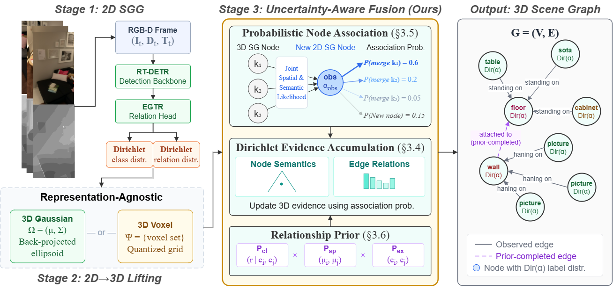
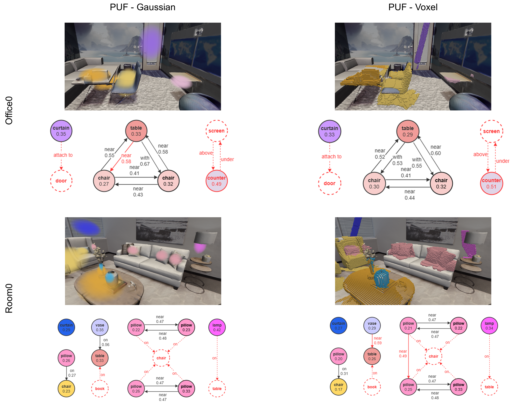

<div align="center">

# PUF: Plug-and-Play Uncertainty-Aware Fusion for Online 3D Scene Graph Generation

Yi Yang, Myrna Castillo, Bodo Rosenhahn, Michael Ying Yang

[](https://arxiv.org/abs/2607.07170)
[](https://github.com/yyyyangyi/PUF)

</div>

<p align="center"></p>


## Abstract

Online 3D scene graph generation builds a persistent, structured representation of a scene by incrementally fusing 2D observations into a global 3D graph. Existing online methods treat this fusion as a fully deterministic pipeline, where we identify three sources of uncertainty that are overlooked: observation, 2D model, and 3D representation. We propose **PUF**: a **P**lug-and-play, **U**ncertainty-aware, and training-free **F**usion framework. Scene graph node association is reformulated as a probabilistic likelihood over semantic and spatial factors, replacing binary accept/reject gates. Dirichlet evidence accumulation distributes class and relationship evidence across plausible candidates proportional to association likelihood. An optional class-conditional prior completes edges for sparsely or never co-observed object pairs. We instantiate PUF with both a 3D Gaussian and a 3D voxel backend and observe consistent improvements, demonstrating its ability to generalize across different representations.


## TODO
- [ ] Release code :clock9:


## Installation and Dataset Preparation

PUF shares the environment, datasets and pretrained weights of [FROSS (ICCV 2025)](https://github.com/Howardkhh/FROSS). Please follow the
[FROSS README](https://github.com/Howardkhh/FROSS/blob/main/README.md) for:

1. [Installation](https://github.com/Howardkhh/FROSS/blob/main/README.md#installation)
2. [Preparing the 3RScan / 3DSSG and ReplicaSSG datasets](https://github.com/Howardkhh/FROSS/blob/main/README.md#prepare-dataset)
3. [Downloading the pretrained RT-DETR-EGTR weights](https://github.com/Howardkhh/FROSS/blob/main/README.md#download-pretrained-rt-detr-egtr-weights) and exporting them to ONNX / TensorRT

No PUF-specific training or weights are needed: the framework wraps the existing 2D SGG model and consumes its full softmax outputs.


## Run PUF

PUF is contained in the `Merging/` directory and leaves the original FROSS path untouched
(the FROSS baseline is still reproduced by omitting `--use_puf`).
All commands are run from the `Merging/` directory. `--use_puf` enables PUF's probabilistic node association. Set
`$ARTIFACT_3RSCAN` / `$ARTIFACT_VG` to the exported RT-DETR-EGTR artifact paths used by
FROSS, and `$DATA_3DSSG` / `$DATA_REPLICA` to the dataset roots.

### Gaussian backend

```bash
cd Merging

# 3DSSG (full model, with relationship prior)
python main.py --artifact_path $ARTIFACT_3RSCAN --dataset_path $DATA_3DSSG --use_puf \
    --lambda_birth 0.4 --likelihood_sigma_jsd 0.3 --beta_min 0.05 \
    --use_spatial_prior --class_prior_path ../Scripts/dataset/prior/3rscan_prior_scaled.npz

# ReplicaSSG (no prior: the dataset has no training split)
python main.py --artifact_path $ARTIFACT_VG --dataset_path $DATA_REPLICA \
    --label_categories replica --use_puf \
    --lambda_birth 0.4 --likelihood_sigma_jsd 0.3 --beta_min 0.05
```

### Voxel backend

Add `--use_voxel` (requires `--use_puf`). Detections are voxelized after depth
filtering and associated by containment score.

```bash
# 3DSSG 
python main.py --artifact_path $ARTIFACT_3RSCAN --dataset_path $DATA_3DSSG \
    --use_puf --use_voxel \
    --voxel_size 0.02 --lambda_birth 0.3 --likelihood_sigma_jsd 0.2 --beta_min 0.05 \
    --use_spatial_prior --class_prior_path ../Scripts/dataset/prior/3rscan_prior_scaled.npz

# ReplicaSSG 
python main.py --artifact_path $ARTIFACT_VG --dataset_path $DATA_REPLICA \
    --label_categories replica --use_puf --use_voxel \
    --voxel_size 0.02 --lambda_birth 0.4 --likelihood_sigma_jsd 0.4 --beta_min 0.05
```

### Relationship prior (3DSSG only)

The class-conditional prior `P_cl(r | c_i, c_j)` and the existence gate `P_ex(c_i, c_j)`
are obtained by a single offline pass over the training annotations (no gradient-based
training). Precomputed files are shipped in `Scripts/dataset/prior/`; to regenerate:

```bash
python Scripts/dataset/compute_relation_prior.py \
    --path $DATA_3DSSG --label_categories scannet \
    --output Scripts/dataset/prior/3rscan_prior_scaled.npz
```

The spatial factor `P_sp` is computed online from the 3D node centroids, so only the
`.npz` needs to be precomputed. Because ReplicaSSG has no training split, the prior is
not used there; PUF still improves over FROSS on all metrics without it.


## Evaluate

`main.py` writes a `.pkl` prediction file whose name encodes the configuration, e.g.
`predictions_gaussian_obj0.7_rel10_hell0.85_kfnone_test_gtpose_puf_birth0.4_jsdsig0.3.pkl`
(`gaussian` → `voxel` for the voxel backend). Evaluation uses the unmodified FROSS
protocol:

```bash
# 3DSSG
python evaluate.py --dataset_path $DATA_3DSSG \
    --prediction_path output/scannet/predictions_gaussian_..._puf_birth0.4_jsdsig0.3.pkl

# ReplicaSSG
python evaluate.py --dataset_path $DATA_REPLICA --label_categories replica \
    --prediction_path output/replica/predictions_gaussian_..._puf_birth0.4_jsdsig0.3.pkl
```

Reported metrics are object / predicate / relationship Recall@1 and the corresponding
mean recalls (mRecall@1), which average per-class recall to mitigate predicate imbalance.


## Main Results

**3DSSG test set** (latency in ms per frame; FROSS is the strongest online baseline):

| Method | Rel. | Obj. | Pred. | mObj. | mPred. | Latency |
| --- | --- | --- | --- | --- | --- | --- |
| FROSS | 27.9 | 62.5 | 33.2 | 63.8 | 18.1 | **13** |
| PUF-Voxel | 40.3 | 65.5 | 46.1 | 64.1 | 21.8 | 31 |
| **PUF-Gaussian** | **46.0** | **69.7** | **51.4** | **65.8** | **28.2** | 15 |

PUF-Gaussian improves relationship recall by **18.1 points** over FROSS while adding
only ~2 ms per frame, and outperforms all point-cloud and RGB-D+SLAM baselines
(3DSSG, VL-SAT, OCRL, SGFN, MonoSSG, SCRSSG, Kim et al.) reported in the paper by an
order of magnitude in latency.

**ReplicaSSG test set** (zero-shot 2D model trained on Visual Genome, no relationship prior):

| Method | Rel. | Obj. | Pred. | mObj. | mPred. | Latency |
| --- | --- | --- | --- | --- | --- | --- |
| FROSS | 22.5 | 26.2 | 28.0 | 29.1 | 20.6 | **14** |
| PUF-Voxel | 22.4 | 27.9 | 26.9 | 30.2 | 17.9 | 30 |
| **PUF-Gaussian** | **25.3** | **31.0** | **35.6** | **33.7** | **26.2** | 16 |

Gains are consistent across both 3D backends and both benchmarks, confirming that the
fusion framework is representation-agnostic and effective independently of the prior.
Ablations of the individual components (Dirichlet nodes, Dirichlet edges, relationship
prior) and hyperparameter sensitivity are reported in the paper.

## Visualization and Uncertainty

Per-frame 2D/3D visualization works as in FROSS via `--visualize_folder` plus
`Merging/Visualization/render.sh`. Additional scripts for the PUF outputs:

```bash
cd Merging/Visualization

# Render the final merged Gaussians (or voxels) from a saved Open3D camera view
python render_predictions.py --dataset_path $DATA_3DSSG --scene <scan_id> \
    --predictions ../output/scannet/predictions_gaussian_....pkl --camera view.json
python render_predictions_voxel.py --dataset_path $DATA_3DSSG --scene <scan_id> \
    --predictions ../output/scannet/predictions_voxel_....pkl --camera view.json
```

<p align="center"></p>

Because nodes and edges carry full Dirichlet distributions, per-node and per-edge
predictive uncertainty can be read out as the normalized entropy `H / H_max`:

```bash
cd Merging
python infer_uncertainty.py --scan_id <scan_id> --dataset_path $DATA_3DSSG \
    --prediction_path output/scannet/predictions_gaussian_....pkl --output_json unc.json
```

Correct predictions typically exhibit low normalized entropy, so this signal can be used
downstream to filter or re-query unreliable nodes and edges.

## Citation

If you find our research useful, please consider citing:

```
@article{yang2026puf,
  title={PUF: Plug-and-Play Uncertainty-Aware Fusion for Online 3D Scene Graph Generation},
  author={Yang, Yi and Castillo, Myrna and Rosenhahn, Bodo and Yang, Michael Ying},
  journal={arXiv preprint arXiv:2607.07170},
  year={2026}
}
```


## Acknowledgements and References

We would like to thank the authors of the following repositories, based on which we built PUF:

- [FROSS](https://github.com/Howardkhh/FROSS) — base framework and ReplicaSSG
- [OnlineAnySeg](https://github.com/yjtang249/OnlineAnySeg) — the voxel backend
- [RT-DETR](https://github.com/lyuwenyu/RT-DETR) / [EGTR](https://github.com/naver-ai/egtr) — 2D scene graph model
- [3RScan](https://github.com/WaldJohannaU/3RScan) / [3DSSG](https://3dssg.github.io/) / [Replica](https://github.com/facebookresearch/Replica-Dataset) — datasets
